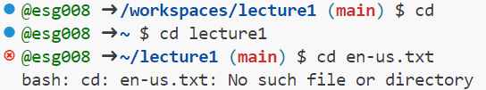
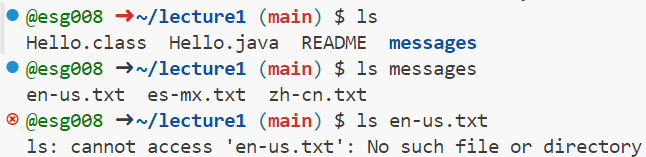
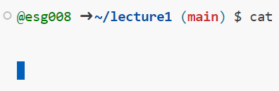
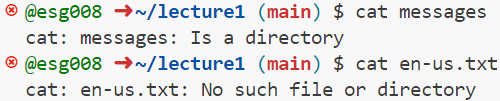

# `cd` 

* Command `cd with **no arguement**:
  - Absolute Path: /workspaces/lecture1
  - Since there was no arguements following the `cd command, it took us back to the home directory.
  - There is no error.
* Command `cd with **path to directory**:
  - Absolute Path: /home/codespace
  - The `cd command changes the directory to the given path which was lecture1. There was no error because "lecture1" is a file.
  - There is no error.
* Command `cd with **path to file**:
  - Absolute path: /home/codespace/lecture1
  - We received an error because the file is not a directory. The command only works with directorys not files.
    
# `ls` 

*Command `ls with no arguement:
  - Absolute Path is /home/codespaces/lecture1
*Command `ls with path to directory:
  - 
* Command `ls with path to file:

# `cat` 

Command `cat` with no arguement:

* Command `cat` with path to directory:

* Command `cat` with path to file:

