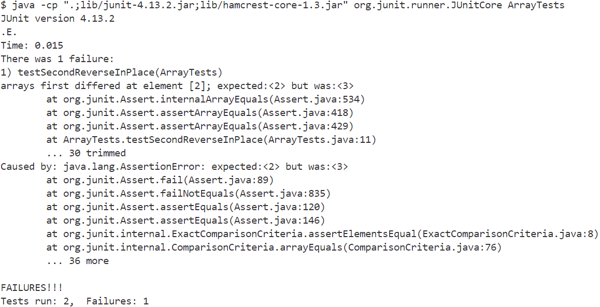

# Part 1: Bugs


* Failure-inducing input
  ```java
    @Test
  public void testReverseInPlace(){
    int [] input = {1,2,3,4};
    ArrayExamples.reverseInPlace(input);
    assertArrayEquals(new int []{4,3,2,1}, input);
  }
  ```
* Input that doesn't induce failure
  ```java
  @Test
  public void testSecondReverseInPlace2(){
    int [] input = {10};
    ArrayExamples.reverseInPlace(input);
    assertArrayEquals(new int []{10}, input);
  }
  ```



**Chosen Bug:** 
* Before
```java
  static void reverseInPlace(int[] arr) {
    for(int i = 0; i < arr.length; i += 1) {
      arr[i] = arr[arr.length - i - 1];
    }
  }
```
* After
```java
static void reverseInPlace(int[] arr) {
    int[] copy = new int[arr.length];
    for(int i = 0; i <copy.length; i +=1){
      copy[i] = arr[i];
    }
    for(int i = 0; i < arr.length; i +=1){
      arr[i] = copy[arr.length - i - 1];
    }
  }
```

- The first implementation would modify the array in the loop which ended up just replacing the first values with the ending values. The fix creates a new copy of the original array that stores original values before reversing. Then iterates through the second copy to effectively reverse the order.

# Part 2: Researching Commands

**`grep`**

 ```$ grep -c Honored grep-gov.txt
  1```

 ```$ grep -r -c "and" government
government/About_LSC/Comments_on_semiannual.txt:113
government/About_LSC/commission_report.txt:703       
government/About_LSC/conference_highlights.txt:89    
government/About_LSC/CONFIG_STANDARDS.txt:103
.....```

  - This command `grep -c` is searching for files that have the goven string and counts its appearances.
 


 ```$ grep -w "household" media-gov.txt
government/Gen_Account_Office/d01591sp.txt:Median elderly household income (dollars)```

 ```$ grep -r -w "household" government
government/Env_Prot_Agen/jeffordslieberm.txt:Overall costs, measured by the decline in household
government/Env_Prot_Agen/jeffordslieberm.txt:ways. The first is as a change in household personal consumption,
government/Env_Prot_Agen/jeffordslieberm.txt:for household demand, production of goods, motor vehicles,   
government/Env_Prot_Agen/tech_adden.txt:estimating equation also included household income as an
....```

- The command `grep -w` searches for files that have a specific word in them.


  
  


