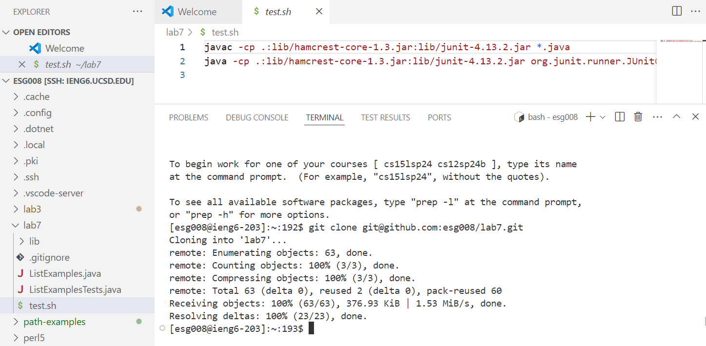
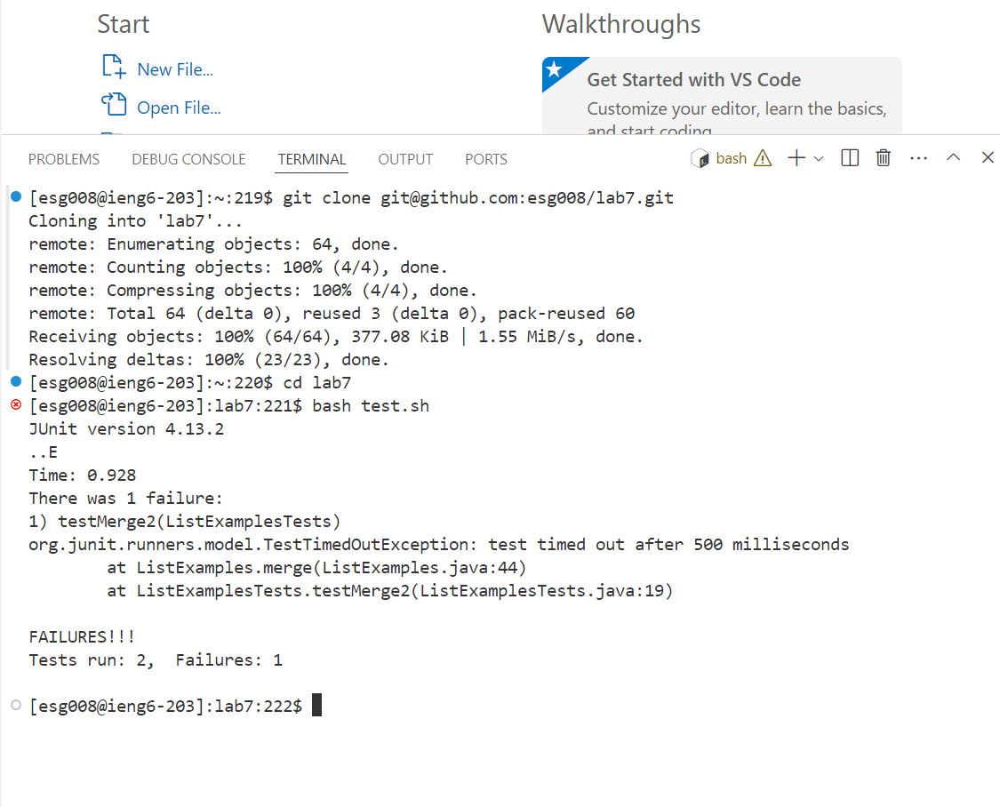
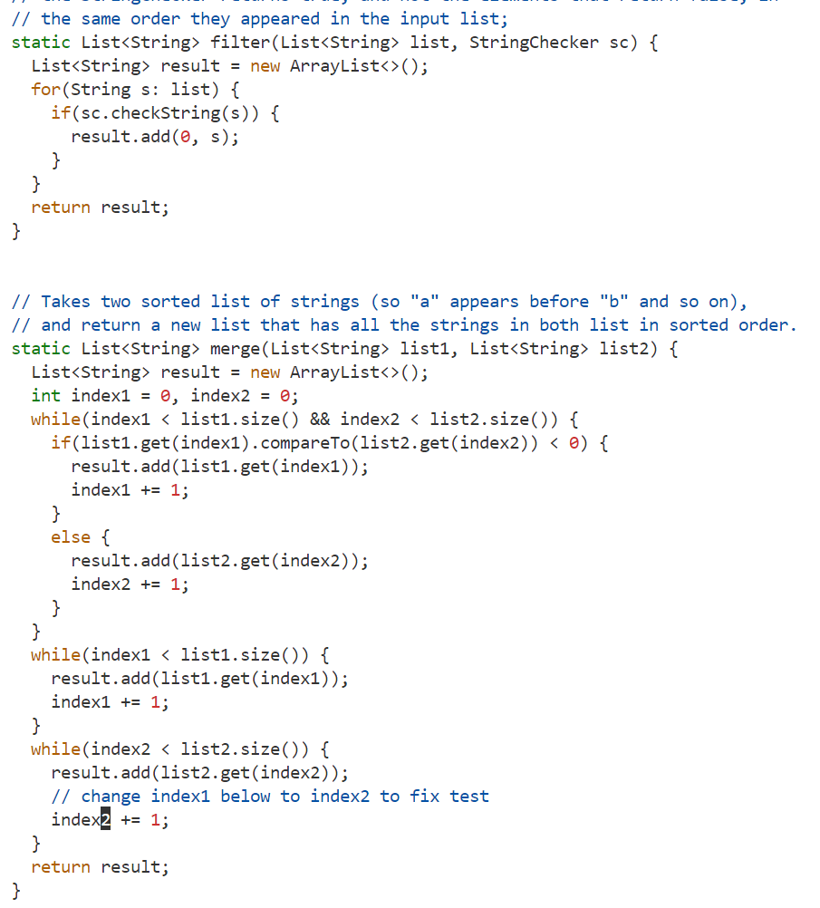
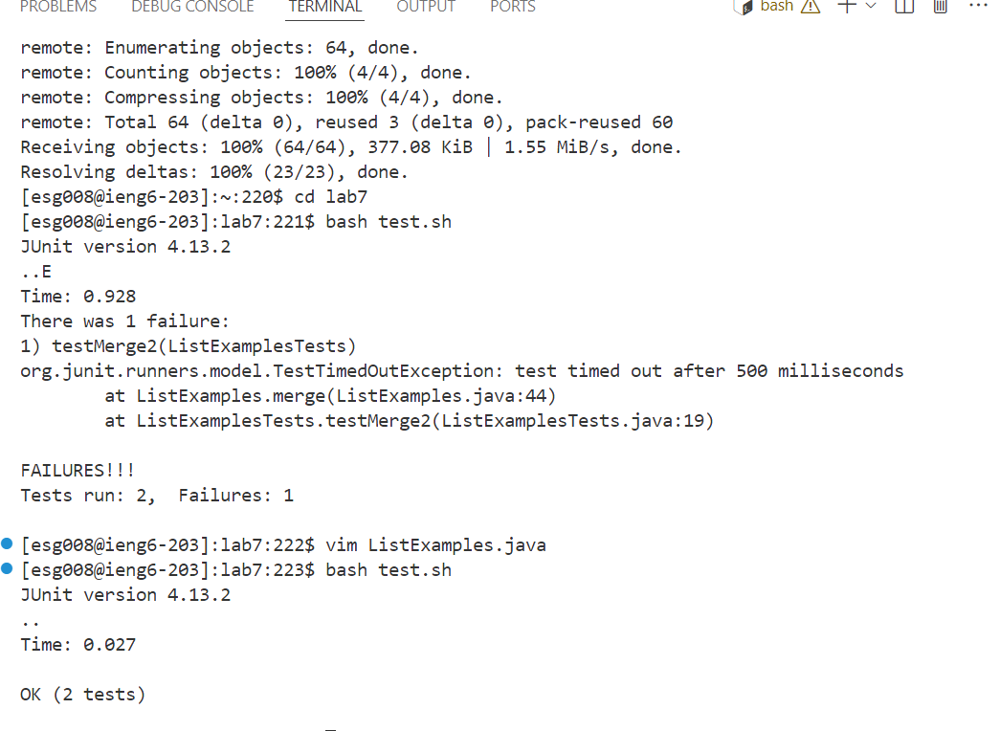
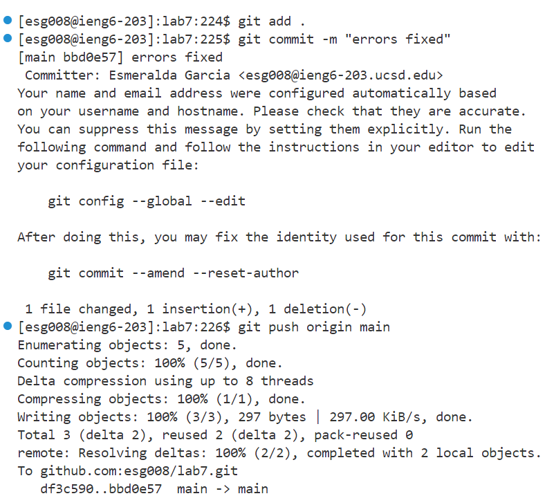

## Lab Report 4 - VIM (Week 7)

**Step 4: Logging into ieng6**

**Step 5: Cloning Repo**
* Keys Pressed: `git <space> clone <space> CTRL-V git@github.com:esg008/lab7.git <enter>. Then, cd <space> lab7 <enter>`

**Step 6: Running Failing Tests**
* Keys Pressed: `bash <space> test.sh <enter>`

**Step 7: Editing File**
* Keys Pressed: `vim <space> ListExamples.java <enter>. `Then, `<up><up><up><up><up><up>`, `<right><right><right><right><right><right><right><right><right><right><right><right><right><right><right>`, `i`, `<backspace>, 2.` Then to save and exit vim, `esc`, `<shift>` + `:`, `wq`

**Step 6: Running Failing Tests**
* Keys Pressed: `bash test.sh` was 2 up in the search history, so I used the up arrow to acces it and hit `<enter>`.

**Step 6: Git add, commint, and push**
* Keys Pressed: None of these commands were in my recent search history so i had to type them out since that would be faster. So I did, `git add . <enter>`, then `git commit -m "errors fixed" <enter>` and finally to make the changes in the GitHub repo `git push origin main <enter>`

  

