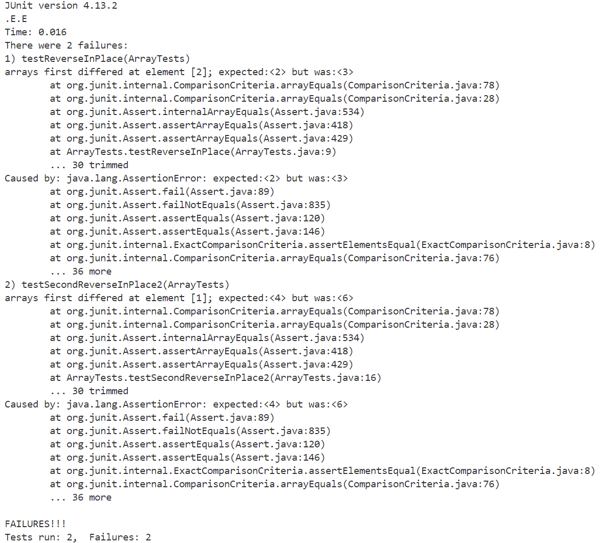
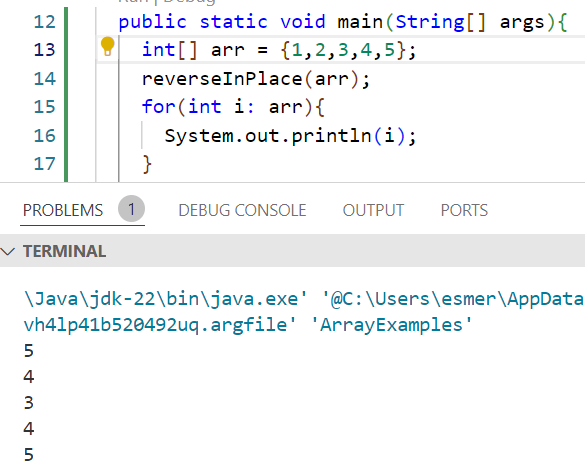
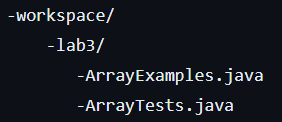
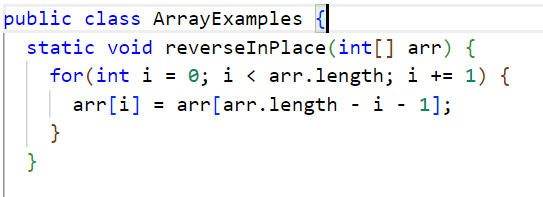
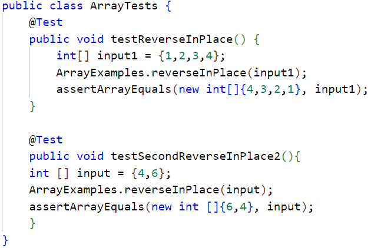

# Lab Report 5: Putting it all together (Week 9)

 **Students Piazza Post:**
 
Hi, I am having trouble with my code. I am trying to test the\
reverseInPlace method but my method is not functioning as expected.\
Im guessing its not properly getting reveresed towards the second half\
of array. Could I get help on how to find a solution for this??

  

---

**TA's Response:**

Hi, the tests might not be giving enough information to figure out\
what eaxctly is happening. To get a better idea of the methods\
functionality, try writing a print statement for the test to see the\
whole output. Hopefully this helps you find a solution, otherwise\
you can reach out again!

---

**Students Reply:**
    
Alright, I added the print statement which did help me figure out\
what was happening. It seems the original method was overwiting the elements\
of the array before they were swapped. Thank You for the help!

 

 ---
 **File and Directory Structre: (File: ArrayExamples.java)**

---

**Contents of each file before fix**

---

**Commands to trigger bug**

`javac -cp ".;lib/hamcrest-core-1.3.jar;lib/junit-4.13.2.jar" *.java`\
`java -cp ".;lib/junit-4.13.2.jar;lib/hamcrest-core-1.3.jar" org.junit.runner.JUnitCore ArrayTests`

---

**Fixing the code**

To fix this, create a new empty array. Then copy elements of the original\
array onto the new array. Reverse elements from the new array and assign to the old array.

**Reflection**

In the second half of the quarter Ive learned a lot of new skills that have allowed me to better\
undesrtand how to use different software tools in efficient ways. Although I found all topics and\
tools interesting, one thing that I have been using the most recently is vim. At first I\
underestimated vims effieciency. I did'nt think it would be any better than editing and navigating\
through files normally. Although it may not seem like a lot, using vim has changed the game for me!\
Another thing I found cool was creating the URL servers from week 2 and getting to know how they worked. 

         

    

  

  
    
